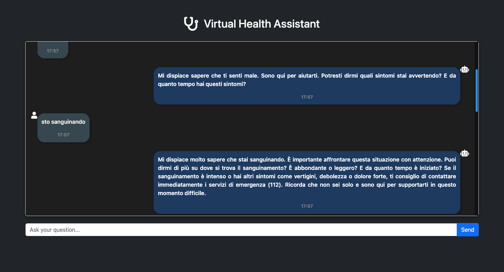

# Virtual Health Assistant


## Overview
The **Virtual Health Assistant** is an AI-powered system designed to assist healthcare professionals in diagnosing and providing medical advice efficiently. It uses OpenAI's GPT-3 and LangChain technologies to offer reliable responses based on medical data. The system is designed to streamline medical consultations and enhance decision-making processes in clinical environments.

### Key Features:
- AI-powered medical assistant for quick diagnosis and patient support.
- Utilizes advanced natural language processing models.
- Customizable for specific healthcare needs.
- Integrated with APIs for enhanced functionality.

---

## Table of Contents:
- [Languages Used](#languages-used)
- [Setting Up the Environment](#setting-up-the-environment)
- [API Keys Setup](#setting-up-api-keys)
- [Demo Video](#demo-video)
[](Virtual Health Assistant.mp4)


- [Installation Instructions](#installation-instructions)

---

## Languages Used:
- **Python**: The core backend language used for AI model integration and handling user requests.
- **JavaScript**: For frontend interaction (if applicable).
- **HTML/CSS**: For creating and styling the web interface.
- **SQL/MongoDB**: For managing data storage and retrieval.

---

## Setting Up the Environment and Installing Dependencies

### For Mac/Linux/WSL:

1. **Create the environment and activate it:**
    ```bash
    python3 -m venv medical-doctor-assistant-env
    source medical-doctor-assistant-env/bin/activate
    ```

2. **Install dependencies:**
    ```bash
    pip install -r requirements.txt
    ```

---

## Setting Up API Keys

### OpenAI API Key
1. If you don't have an OpenAI API key yet, you can sign up [here](https://openai.com/index/openai-api/).
2. Set your `OPENAI_API_KEY` in your environment variables.

### LangSmith API Key
1. Sign up for LangSmith [here](https://smith.langchain.com/).
2. Learn more about LangSmith and how to use it within your workflow [here](https://www.langchain.com/langsmith), and check out the relevant library [documentation](https://docs.smith.langchain.com/).
3. Set the following environment variables:
    ```bash
    LANGCHAIN_API_KEY=<your-api-key>
    LANGCHAIN_TRACING_V2=true
    ```

---

## Upgrade pip (optional)
To ensure you're using the latest version of `pip`, run:
```bash
pip install --upgrade pip
