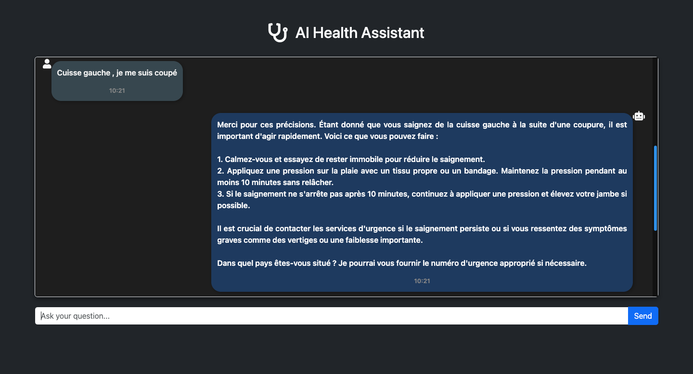

# AI Health Assistant



## Overview
The **Virtual Health Assistant** is an AI-powered system designed to assist individuals by providing helpful, reassuring, and medically sound guidance based on their symptoms. Leveraging OpenAI's and LangChain technologies, it offers reliable responses based on medical data. The system aims to streamline medical consultations and enhance decision-making processes in clinical environments.

### Key Features
- 🩺 AI-powered medical assistant for quick diagnosis and patient support.
- 🧠 Utilizes advanced natural language processing models.
- ⚙️ Customizable for specific healthcare needs.
- 🌐 Integrated with APIs for enhanced functionality.

---

## Table of Contents
- [Languages Used](#languages-used)
- [Setting Up the Environment](#setting-up-the-environment)
- [API Keys Setup](#api-keys-setup)
- [Installation Instructions](#installation-instructions)

---

## Clone Repository
To clone the repository, use the following command:
```bash
git clone https://github.com/LeonDoungala22/Virtual-Medical-Doctor-Assistant.git
```

---

## Setting Up the Environment and Installing Dependencies

### For Mac/Linux/WSL

1. **Create the environment and activate it:**
    ```bash
    python3 -m venv medical-doctor-assistant-env
    source medical-doctor-assistant-env/bin/activate
    ```

2. **Install dependencies:**
    ```bash
    pip install -r requirements.txt
    ```

---

## API Keys Setup

### OpenAI API Key
1. If you don't have an OpenAI API key yet, sign up [here](https://openai.com/index/openai-api/).
2. Set your `OPENAI_API_KEY` in your environment variables.

### LangSmith API Key
1. Sign up for LangSmith [here](https://smith.langchain.com/).
2. Learn more about LangSmith and how to use it within your workflow [here](https://www.langchain.com/langsmith), and check out the relevant library [documentation](https://docs.smith.langchain.com/).
3. Set the following environment variables ( .env) :
    ```bash
    LANGCHAIN_API_KEY=<your-api-key>
    LANGCHAIN_TRACING_V2=true
    LANGSMITH_PROJECT="your project name"
    ```

---

## Upgrade pip (optional)
To ensure you have the latest version of pip, you can upgrade it using the following command:
```bash
pip install --upgrade pip
```

---

## License
This project is licensed under the MIT License - see the [LICENSE](LICENSE) file for details.

---

## Collaboration
For any collaboration inquiries, please contact Leon Doungala at [doungala.leon@gmail.com](mailto:doungala.leon@gmail.com).

---

## Copyright
© 2025 Leon Doungala. All rights reserved.
